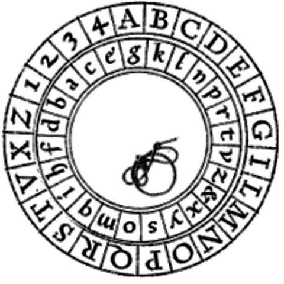
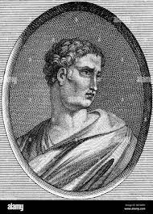

## Los discos de cifrado
En el siglo XV, León Battista (Arquitecto italiano y secretario personal de tres papas) inventó dos anillos concéntricos con el alfabeto grabado en ellos, uno con el alfabeto ordenado y el otro alternado. Asi facilitando la lectura y escritura de texto cifrado al encajar los anillos y enroscarlos, así se conseguia el codigo de cifrado cuya clave representaba las vueltas del que se les daba a lso anillos.

 

## El cifrador de Playfair

Este sistema consiste en separar el texto en claro endigramas y proceder a su cifra de acuerdo a una matriz alfabetica de dimensiones 5x5 en la cual se encuentra representadas 25 de las 26 letras del alfabeto ingles. Para que este metedo funcione, se incluira al cominezo de dicha matriz una clave que se escribe a partir de la primera fila 

#Cifrado de Polybios
* Es considerado el cifrado más antiguo del que se tiene registro. Fue creado en el siglo 2 A.C. por el historiador griego Polybios.

* Este sistema es un cifrado por sustitución de caracteres, se coloca todo el alfabeto en una matriz y cada letra tiene su posición en la que será convertida.
* Consiste en sustituir un carácter por el numero o letra de una columna o fila.

* Para que lo entiendas más fácil mente, es como si estuvieras jugando al hundir la flota.

